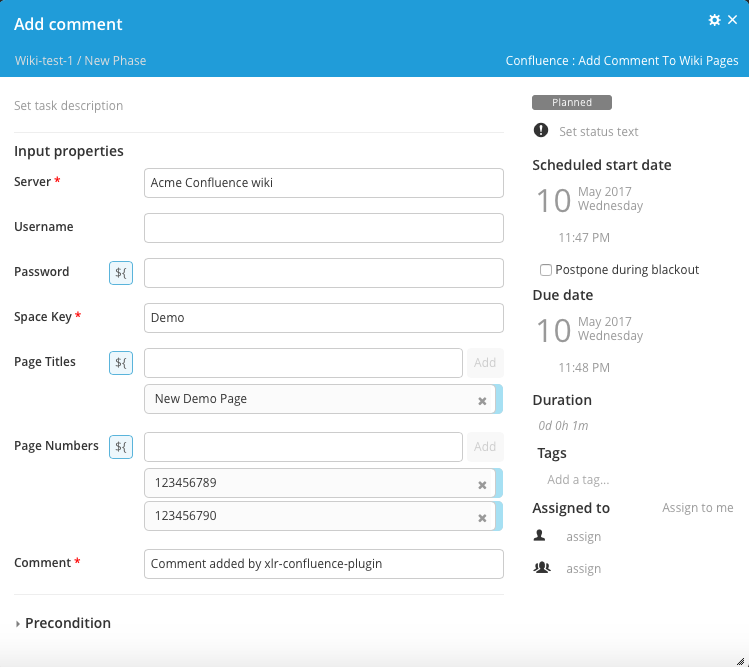
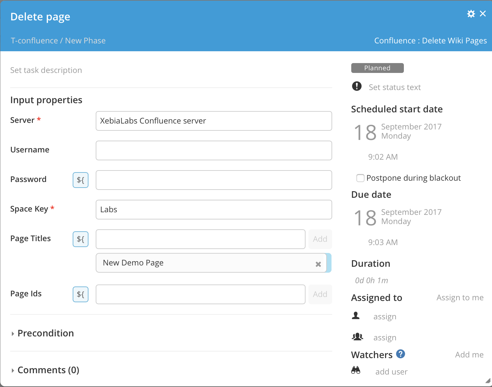
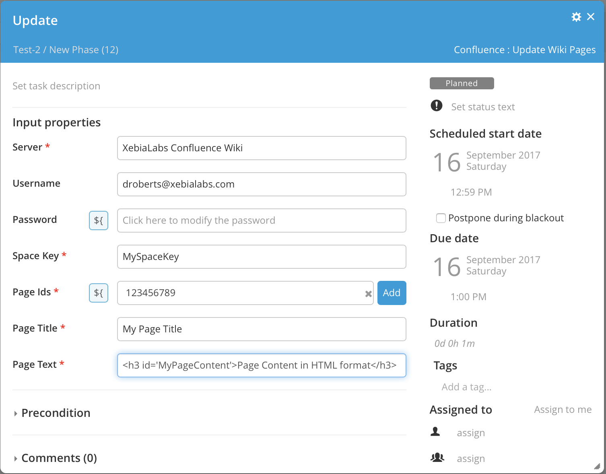
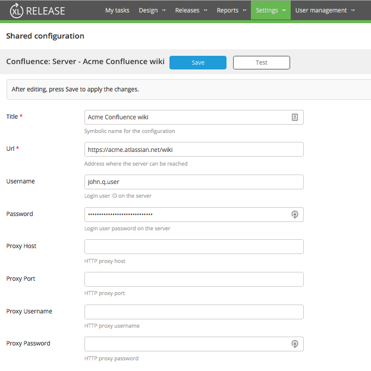

# XL Release Confluence plugin #

## CI status ##

[![Build Status][xlr-confluence-plugin-travis-image]][xlr-confluence-plugin-travis-url]
[![License: MIT][xlr-confluence-plugin-license-image]][xlr-confluence-plugin-license-url]
![Github All Releases][xlr-confluence-plugin-downloads-image]

[xlr-confluence-plugin-travis-image]: https://travis-ci.org/xebialabs-community/xlr-confluence-plugin.svg?branch=master
[xlr-confluence-plugin-travis-url]: https://travis-ci.org/xebialabs-community/xlr-confluence-plugin
[xlr-confluence-plugin-license-image]: https://img.shields.io/badge/License-MIT-yellow.svg
[xlr-confluence-plugin-license-url]: https://opensource.org/licenses/MIT
[xlr-confluence-plugin-downloads-image]: https://img.shields.io/github/downloads/xebialabs-community/xlr-confluence-plugin/total.svg

### Functionality ###

#### Task: Add new wiki page under one or more existing parent wiki pages ####

A page with the given page title and page text will be added as a child page under all parent pages matching the parent page titles and parent page numbers within the space key.

The page text should be formatted with HTML tags.

#### Task: Add a comment to one or more existing wiki pages ####

A comment will be added to all pages matching the page titles and page numbers within the space key.

#### Task: Delete one or more wiki pages ####

The specified pages will be deleted.

#### Task: Update one or more wiki pages ####

The specified pages will be updated with the new page title and new body text.  The prior contents of the page will be replaced.

The page text should be formatted with HTML tags.

### Server configuration ###

